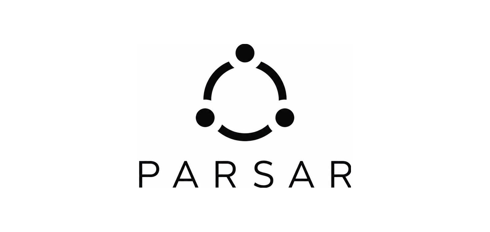

<p align="center">
  
</p>

<p align="center">
  <b>Your team's intent, parsed into action.</b>
  <br />
  An open-source control plane for running AI coding agents with team context.
</p>

> [!IMPORTANT]
> Parsar is in active alpha development. The local Docker path is intended for
> evaluation and development. Production self-hosting, additional providers,
> and several workflow surfaces are still being hardened.

## What Parsar Is

Parsar connects team workflows to background AI coding agents. The goal is to
let a team dispatch work from chat, the web UI, or an API; run the agent in a
controlled environment; and keep the run history, logs, permissions, and
results in one place.

Today, Parsar is best treated as a working alpha: useful for local evaluation,
development, and integration work, but not yet a finished production product.

## What Works Today

- Local Docker startup with mock auth and a bootstrapped workspace.
- Go server, React web UI, PostgreSQL storage, and OpenAPI generation.
- Workspace, agent, conversation, run, audit, model, secret, and runtime
  foundations.
- Agent daemon connector work for local agent CLIs such as Claude Code, Codex,
  and opencode.
- Feishu / Lark integration paths under active development.
- Postgres-backed queue and run state; no Redis or external message queue is
  required for the core server.

## Current Limitations

- Production self-hosting is still being hardened. Use the deploy docs as an
  operator runbook, not as a guarantee that every production concern is solved.
- Some end-to-end smoke coverage still skips the full runtime / audit / usage
  chain while business APIs are promoted from development routes.
- Slack, Discord, GitHub OAuth, Google OAuth, email magic-link auth, memory
  workflows, and the capability marketplace are roadmap items.
- The public container image flow is not the primary quick-start path yet; the
  local Docker path builds the image from source.

## Quick Start

Requires `git` and Docker with the `docker compose` subcommand. Go, Node, and
pnpm are not required on the host for this path.

```bash
git clone https://github.com/MiniMax-AI-Dev/parsar.git
cd parsar
docker build -t parsar:local .
PARSAR_SERVER_IMAGE=parsar:local docker compose -f docker-compose.local.yml up
```

Open <http://127.0.0.1:18080>. Mock auth signs you in as
`admin@example.com` in a freshly bootstrapped workspace.

The first build can take several minutes because it downloads Go modules,
installs pnpm dependencies, and builds the web app. Later builds should reuse
Docker cache.

## Development

Read [CONTRIBUTING.md](CONTRIBUTING.md) before implementation work. It is the
canonical contributor guide for worktree usage, architecture rules, generation
steps, and required checks.

Prerequisites for the local development path:

- Go 1.25 or newer
- Node 20 or newer
- pnpm 9 or newer
- Docker, used for PostgreSQL

```bash
make setup
make dev
make check
```

Open <http://localhost:5173> for the web UI and <http://localhost:8080> for
the server.

## Architecture

```text
Team surface  ->  Parsar server  ->  Agent worker
chat / web / API       |              sandbox / daemon
        ^              |
        |              v
        +--------- PostgreSQL
```

Parsar is built around a Go server, a PostgreSQL database, a React web UI, and
worker processes for agent execution. PostgreSQL carries the queue, state, and
audit trail for the core server.

For the longer design notes, see [docs/architecture.md](docs/architecture.md).

## Project Layout

```text
apps/       Go binaries, daemon, and React web app
packages/   shared TypeScript packages and generated client code
server/     server packages, migrations, and API handlers
internal/   shared private Go packages
docs/       architecture notes, deploy runbooks, and OpenAPI output
deploy/     compose examples and deployment assets
```

## Docs

- [INSTALL.md](INSTALL.md): agent-friendly local install instructions.
- [CONTRIBUTING.md](CONTRIBUTING.md): development protocol and required checks.
- [docs/architecture.md](docs/architecture.md): architecture overview.
- [docs/deploy/deploy-runbook.md](docs/deploy/deploy-runbook.md): deployment
  runbook and current production-readiness status.
- [docs/openapi/openapi.yaml](docs/openapi/openapi.yaml): generated OpenAPI
  artifact. Do not edit it by hand.

## Security

Found a vulnerability? Please file a private report via
[GitHub Security Advisories](https://github.com/MiniMax-AI-Dev/parsar/security/advisories/new).
See [SECURITY.md](SECURITY.md) for the full policy. Do not open a public issue.

## License

Parsar is released under the [MIT License](LICENSE).
